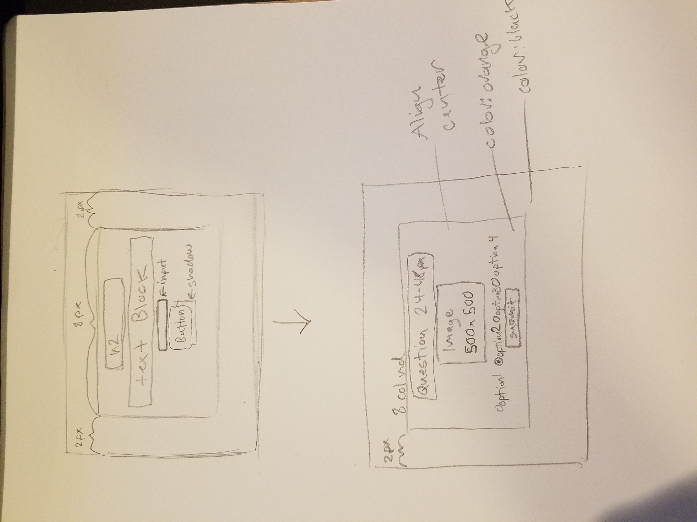

# CS460 Homework 2

# Return to?
### [Code Repo](https://github.com/Alex-Bishop1296/Alex-Bishop1296.github.io) 
### [Home](../index.md) 
### [CS460 Assignments](cls-cs460.md) 

# Link to finished project:

### [Homepage](http://alex-bishop1296.github.io/HW2/html/index.html)

# Notes

# 1.[Setup] 
My first task was to make a new folder in my git repository for my assignment. I got into where my repo is stored locally and place a folder for homework 2 as HW2. From here, I need to branch off and start the assignment. To do this, I run the command:
```
git checkout -b homework-two
```
This is just shorthand for the branch and checkout commands. Thus, I made a new branch from my current one in master and started working on it. From here I make subfolders for html, css, js, and img files. Then in those files I make a index.html, styles.css, and *.js file to work on later.

# 2.[Planning and Design]
After a period of deliberation, I decided to make a quiz as my project. To make it more holloween themed I would quiz on names and triva of bones in the human body.

# 3.[Planning and Design]
Next up, I plannout the layout of my website. I write up some simple instructions that look like so:



I decided to have a single container that took up a container with a 8 grid size md setup, spaced out by 2 grid spaces (refering to bootstrap grid). On the title screen, we have a H2 element with some text under it explaining the quiz, then a start button with shadow. In the quiz page, I have a header, Image that would be present of invisable depending on the questions, a ul of radio buttons for the user answer, and finally the next question button.
