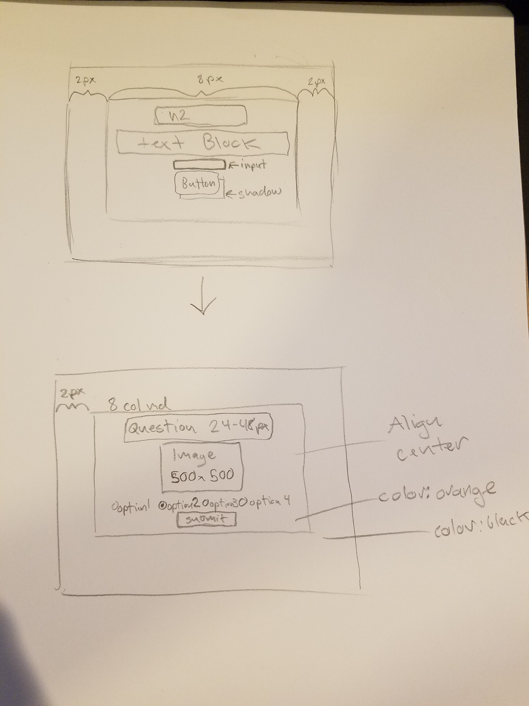

# CS460 Homework 2

# Return to?
### [Code Repo](https://github.com/Alex-Bishop1296/Alex-Bishop1296.github.io) 
### [Home](../index.md) 
### [CS460 Assignments](cls-cs460.md) 

# Link to finished project:

### [Homepage](http://alex-bishop1296.github.io/HW2/html/index.html)

# Notes

# 1.[Setup] 
My first task was to make a new folder in my git repository for my assignment. I got into where my repo is stored locally and place a folder for homework 2 as HW2. From here, I need to branch off and start the assignment. To do this, I run the command:
```
git checkout -b homework-two
```
This is just shorthand for the branch and checkout commands. Thus, I made a new branch from my current one in master and started working on it. From here I make subfolders for html, css, js, and img files. Then in those files I make a index.html, styles.css, and *.js file to work on later.

# 2.[Planning and Design]
After a period of deliberation, I decided to make a quiz as my project. To make it more Halloween themed I would quiz on names and trivia of bones in the human body.

# 3.[Planning and Design]
Next up, I plan out the layout of my website. I write up some simple instructions that look like so:



I decided to have a single container that took up a container with a 8 grid size md setup, spaced out by 2 grid spaces (referring to bootstrap grid). On the title screen, we have a H2 element with some text under it explaining the quiz, then a start button with shadow. I also included a text field for the player to input their name. In the quiz page, I have a header, Image that would be present of invisible depending on the questions, a ul of radio buttons for the user answer, and finally the next question button. I decided to go with a black and orange coloring scheme for all cards in on the Halloween theme.

# 4.[Coding]
Quite a few things to go over here so I will try to be brief. First is the requirement for response to user output. I have three types of user input: buttons, radio forms, and an input field. Due various issues working with asynchronous code, I had to think of a good workaround for setting up my buttons as my original plan of one progression button caused too many issues. Thus, in html, my buttons look like this:
```html
 <button id="progression">Start Quiz</button>
 <button id="submission">Submit</button>
 <button id="restarter">Play Again?</button>
```
I actually have a button for each type of function that needs to be executed, then I hide them based on where in the quiz the user is (ie what button they should have access to). I use a simple toggle to do this, like right when I initialize the page as so:
```js
    // Make submission and restarter button invisible before load
    $("#submission").toggle();
    $("#restarter").toggle();
    // Allow buttons to be shown by fade in (prevents blinking effect)
    $('div.hidden').fadeIn(1000).removeClass('hidden');
```
You might notice that this would normally cause all buttons to flicker when the page is loading in, a visible tick. To prevent this, I include a "hidden" class on my entire container like this:
``` html
<div class="container-fluid text-center hidden">
```
This allowed me to run a .fadeIn() (seen in the toggle block of code) that would cause the entire page to load in, then fade in, hiding any graphical issues. A cool looking work around if I do say so myself. It also hits my requirement of modifying a element of the page using jQuery. Next up, we can talk about my radio form.

The radio form inputs filled my requirements of having a list with multiple child elements, having multiple form elements (radio elements and input fields), and adding new list type elements to the page. Again, these would act as the answers a user could input for given questions. I started with some html that looks like this:
```html
<form>
    <ul id="question_choices"></ul>
</form>
```
This is simply a form element wrapping a unordered list element with the id "question_choices" assigned to it. Inside this ul I would add multiple child elements so I could create the radio options. The logic looks like this:
```js
    // Remove all current <li> elements (if any)
    $("#question_choices").find("li").remove();

    // For each choice in the current questions choices, insert into list
    For (I = 0; I < questions[currentQuestion].choices.length; i++) {
        choice = questions[currentQuestion].choices[i];
        // Append item to the radio list
        $('<label class="radio-inline"><li><input type="radio" value=' + i + ' name="dynradio" />' + choice + '</li></label>').appendTo("#question_choices");
    }
```
This is logic per question displayed, so I start by removing any list elements that were present from the last question before adding new ones. Then, in a for loop that is the length of the new questions choices array, I assigned each choice to a radio button with a label for the name of the choice and append it to the list of choices in the question_choices id. Thus, I added new html elements to my code that forms a list. Just for a better picture of my questions class, it is an array of custom objects, like so:
```js
var questions = [{
    prompt: "What bone is this?",
    image: "../img/001.jpg",
    choices: ["Fibula", "Femur", "Tibia", "Tarsus"],
    correctAnswer: 1
},
{
    prompt: "What bone is this?",
    ...
},
...
}]
```

The input field was my final tack on for a extra form. It looks like this in html:
```html
<input type="text" id="name" value="Enter your name!">
```
All I do is save this information when inputted, and later reuse it when giving the user their results. Nothing really much else to say on that point.

The actual logic for progression in my coded game is kinda dense, but well commented. I will leave that in the code if you want to see more details, but as of this statement, all requirements of the code have been discussed in detail. The response on user input comes with the function calls of each button, including error messages as alerts when the user has no/misinformation. 

# 5.[Testing]
I won't detail my entire test process and getting the button solution working alone took many iterations. How, do note that I have alert if/else loops set up to prevent lack of input on radio buttons and incorrect input on name. Additionally, I have plenty of console.log() debug lines to make sure what is happening in execution when I debug in developer mode.

# 6.[Turn it in]
Finally I needed to merge my commits back to master, the code for that looked like this (FYI I already went over this last assignment):

```
git checkout homework-two
git pull origin master
git checkout master
git merge homework-two
```

After my last commit and push from homework-two I checkout homework-two (for safety), then pull master, checkout master, and merge in homework-two. With this, my assignment was complete.