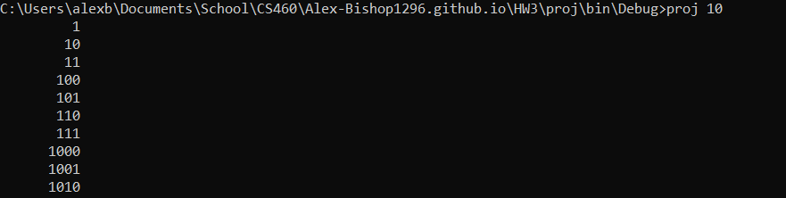

# CS460 Homework 3

# Return to?
### [Code Repo](https://github.com/Alex-Bishop1296/Alex-Bishop1296.github.io) 
### [Home](../index.md) 
### [CS460 Assignments](cls-cs460.md) 

# Notes

# 1 & 2.[Setup] 
Setup for this project was just having visual studio community 2017 installed, as I had already done before in the past their was noting else to do for this step. I simply downloaded the java files and started to translate them as I will detail below.

# 3.[Planning and Design]
Let me go over some of the concepts I learn pouring over the java code. The first thing The first node file contains the class with the public scope Node\<T>. Seen here:

 The \<T> is a type parameter (also called type variables) that can be used A type variable can be any non-primitive type you specify: any class type, any interface type, any array type, or even another type variable. This same technique can be applied to create generic interfaces. Essentially this allows multitudes of object types inside this object class. The genral purpose of the node code being holding an object and the reference to the next object it points to be used in a abstact data structure.

 The next major concept from the java code was the interface, shown here:

 

 An interface is a container for a future class of data that contains prebuilt either function names or default functions that can be implemented to facilitate use in the same style. This allows a classes of similar types to share code with repeating the implementation of it. In our case the interface is just used to for the sake of it, as LinkedQueue is the only class that uses it. Interfaces can also be though of the header file in a C++ enviroment, although more specialized.

 The final major concept in the java file I would like to go over is the Exception, seen here: 

 

 Exceptions are a way of handling errors with the proper response to the user. In this case, it contains both a messaged exception and one without a message. This allows the exception to be called with just the name of it for the user or a more specific error message is some cases. Exceptions are a common language concept typically associated with try catch execution.

 These where the major concepts from the java code that jumped out at me as needing some review. From here I decided to to brush up on some C# syntax and then jump into the translation with the Node.java file.

# 4 - 6.[Coding and Content]
I started with Node.java file. This translation was pretty much exactly the same as the original one in C#, with some naming conventions changed to follow C# conventions. It contains a next Node<T> or it takes in a type parameter, while the object itself contains a next pointer to another node and a Type parameter for the data. This is also all contained in the namespace of the project, called SolHW.

Moving on, I created my Queue interface, I had to change the name to IQueueInterface.cs to follow the naming convention of interfaces in C#. From here we made some minor changes, let's look at the code:

We notice a few changes I had to make. The first is that we added our namespace, SolHW. Next, although the format of the interface is close to that of it's java counterpart, we have removed the Throws syntax on Pop(), conveted variable types like Boolean to the C# equilvalent bool, and changed names based on C# conventions. The Throws syntax is not used in C#, so although I reference it with the XML comments, I will not actually code it in here. I will be used later when I actually implement the interface. As the other changes are self-explanatory, let's move onto the next file.

Next, I had edits for the QueueUndeflowException file in java to C#. This one remains MOSTLY the same, with one major syntax adjustment:

Here, we had to adjust the actual call inside each exception, as C# uses base() implementation via interface rather than using Super() like java. Additionally, we make QueueUndeflowException implement the Exception interface from system to allow the proper inhiertance of funtionality. As always, we include all of this code inside SolHW.

With this code out of the way, we move onto the LinkedQueue. This class implemented the actual code from our interface from earlier. The purpose of this code was to use Node.cs and QueueUnderflowException with the inteface to create a singly linked First In, First Out (or FIFO) queue. We start with a front and back node, as well as a constructor, like so:

The first and last Node variables will be the basis of our queue, and the constructor thusly intializes them as null values. We do not allow a constuctor with given values to avoid the error checking of non-nullable types at intialization. Next up, we implement the Push() function from the interface:

Here we throw an exception if the given value is null, and then, depending if the queue is empty or not, we add the element to the queue positionaly. The null reference exception departs from the java code in syntax, but aside from that, this code remains mostly the same as it's java partner. Next, we have the Pop() implementation:

As mentioned earlier, we use the throws QueueUnderflowException to stop the user from poping from a empty queue, otherwise this code simply returns the last element of the queue and adjusts the queue to compensate. Aside from the adjustment on the error throwing, only naming conventions have changed here, the code remains mostly the same. Finally we have the implementation of IsEmpty(). This is the same as the implementation as the java code aside from syntax and naming, so I don't feel it needs to be shown here.

The final file we have to translate is the main.java, containing the actual bulk of our code. I made this file with my Program.cs. Let's look over some of the code:

Here we have the code inside GenerateBinaryRepresentationList(). The purpose of this code is to A function for generating the list of binary numbers for a given number. We start by genrating a linked queue of dynamic strings, and a linked list of strings. If the given value to genrate it binary is negative, it catches the error and fails as we did not set up for this. Nest we setup the binary tree based on the number of binary values we have to count from. Next, we have the code of the main:

First we have some error code for if the user does not give the right number of arguments, including a return out. Mainly some syntax differences here, such as using console istead of system. Next we parse the list of ints with a try catch to make sure all the values are valid. Finally in a foreach loop we print out all the binary values, the result looks like this:

With this, the code is complete, I built the solution and it was in expected parameters. With this, the project was submitted as you see here.
