# CS460 Homework 4

# Return to?
### [Code Repo](https://github.com/Alex-Bishop1296/Alex-Bishop1296.github.io) 
### [Home](../index.md) 
### [CS460 Assignments](cls-cs460.md) 

# Notes

# 1 & 2.[Setup & Planning] 
For this project I started by making a MVC project in Visual Studio. Before making any major commits, I branched my repostory into hw-four and made changes to my .gitignore. I decided to use a template off the web to avoid including any of the many MVC files I did not know much about. I chose to stay on my hw-four branch for now instead of branching into my first feature branch to allow the homepage to be relatively consistent between the two branchs.

# 3 - 5.[Coding and Content]
For starters, we needed to make a Home/Landing page for this assignment. When the default project was generated by visual studio, most of the landing page format was ready to go but needed some changes. Let's start by looking at the code for the end of my project:

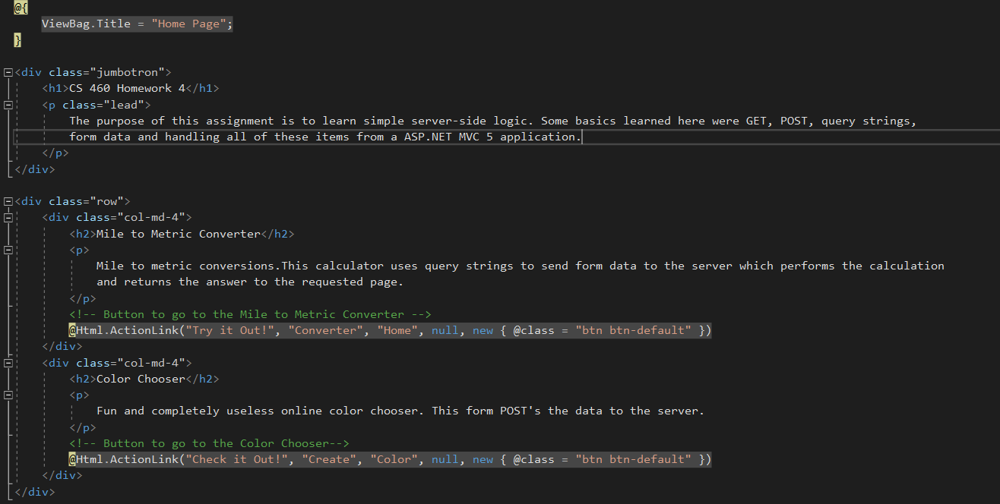

Breaking this down, the start of the page opens with a Viewbag. This is a dynamic ASP.NET MVC property of ControllerBase class which is the base class of all the controllers.You can assign any number of properties and values to ViewBag. If you assign the same property name multiple times to ViewBag, then it will only consider last value assigned to the property. Here we really only use it for the title of this view (the actual CSHTML) of our site. Below it we have Bootstrap html elements for a Jumbotron and two rows containing text and buttons. Most of these items were is place by default so I won't discuss, but this page raises the question when we look at the final result. The view is shown as the image below:

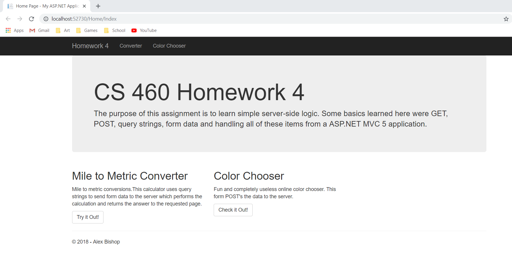

We can see that elements not in that homepage view code are on the homepage view, such as the navbar and footer. Well, these elements are shared between webpages, so they are actually held in a layout file. Let's look at that file right now:

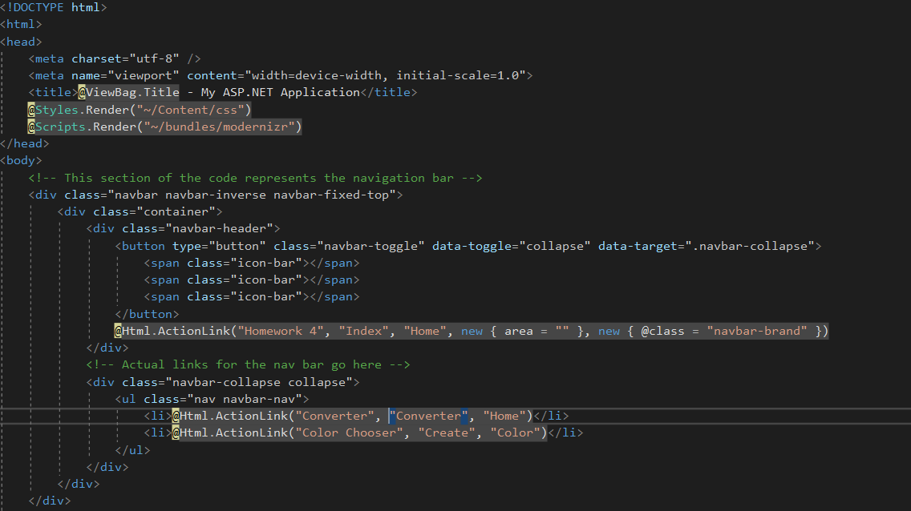
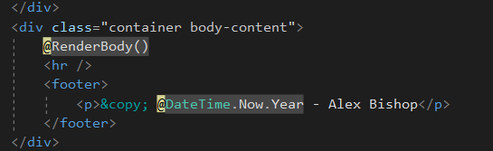

I have only include the parts of the code here where I made edits, ie the navbar and the footer. For the most parts the Razor HTML buttons are the same as the default ones, but I should take the time to explain them here. Razor helper functions allow the user to implement html items using cs. One of the ones shown here is:
```csharp
@Html.ActionLink("Converter", "Converter", "Home")
```
This action link creates a link to a button called "Converter" pointing at the "Converter" view in the "Home" controller. These are both a requirement and the way I do my links, as you can see in the homepage code. The other changes you can see here are the contents of the paragraphs, links, and the footer. The all culminate in my home page. With this completed to statisfaction, I was ready to branch to the my first feature from homework 4. I would start with the converter since it had the same controller as the homepage. After creating a branch from hw-four and checking it out. I started with the cshtml, which I will show below:


This will make more sense when we go over the converter code in the Home controller, but I will explain what I can. We start with a header that has a viewbag message. This just grabs the viewbag variable for title from our controller and displays it. Next, in the body, we have a form element with the method "get" and the path to the current page, this will be used for the reload of the page with or without results. Next we have radio buttons and number input field, nothing much to say about these as they just are requirements, you can notice that number field limits inputs to just numberic values (this is not the case for direct input via url). Finally we have a viewable message locked behind a if check, this is where we will put the output of the calculation. This is all fine and good, but now we need to see the actual logic behind displaying this info, we can see this below as the controller code.

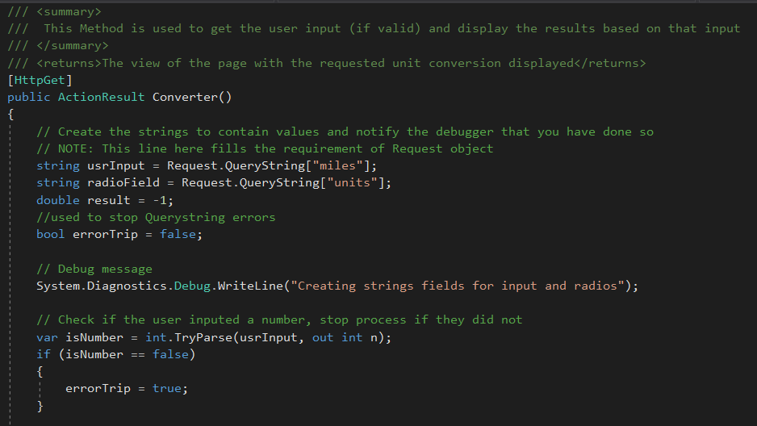
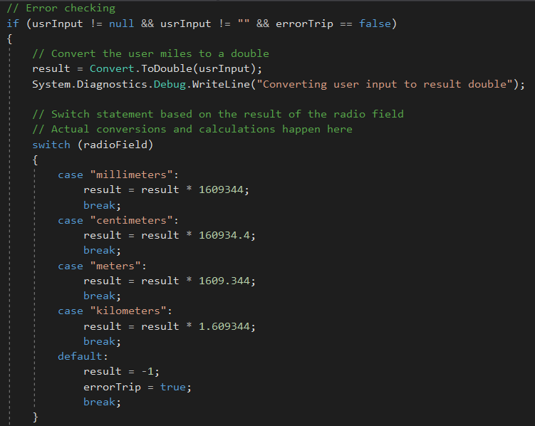
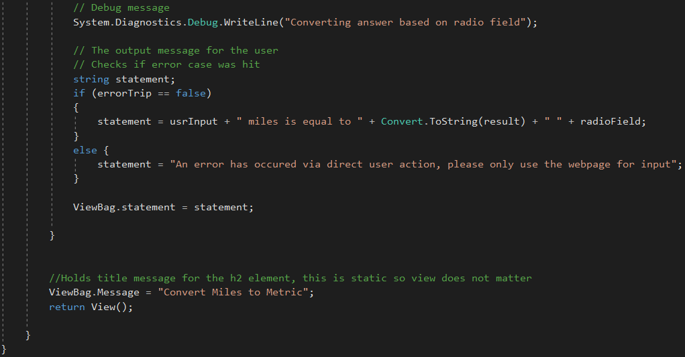

Alright, this is a lot of code so let's break it down. We start with the HttpGet tag before are method. This is used to automatically trigger the search for the query strings. Speaking of which we start the converter method to get the strings radio field and the user input from query strings. Without getting too techinical this means it will be in the url that the user can edit to retrieve. Next up we got some debug code. The code below the debug message is to prevent the user from entering a nonnumber in the query string. After this, we start are with our logic (if error checks pass) for how to do the calculations on the query strings. We start by converting the user input to a double and printing a debug message for it. After this, we perform a calculation to convert it the units we need based on the given unit type. If the unit type is not a known one, the switch statement will to trigger a error state and accompanying message. After one more debug message we have the print state, allowing the statement element to become a non-null and display on the html, and an error statement message linked to it. Finally we have the viewbag title message and the return for the view. So now let's look at this page in practice, starting with the default view:

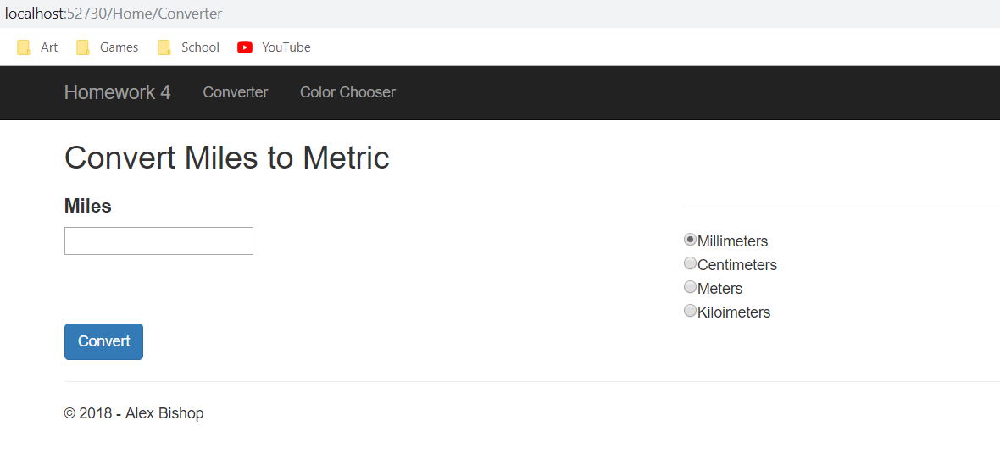

This is what the page looks like when no input has been given. Note the default URL and the number field with radio buttons for each option. Now let's see what happens if we give it some input. Say 1 mile:

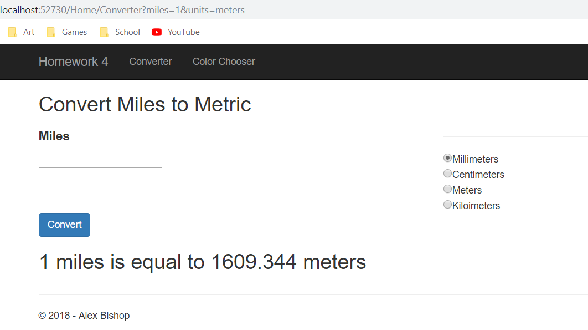

As expected, it displays the conversion below. Note the entered fields in the url. What if we where to directly enter our answers there. Say, 1 mile to ducks? Well, we would correctly trigger an error state and get this:

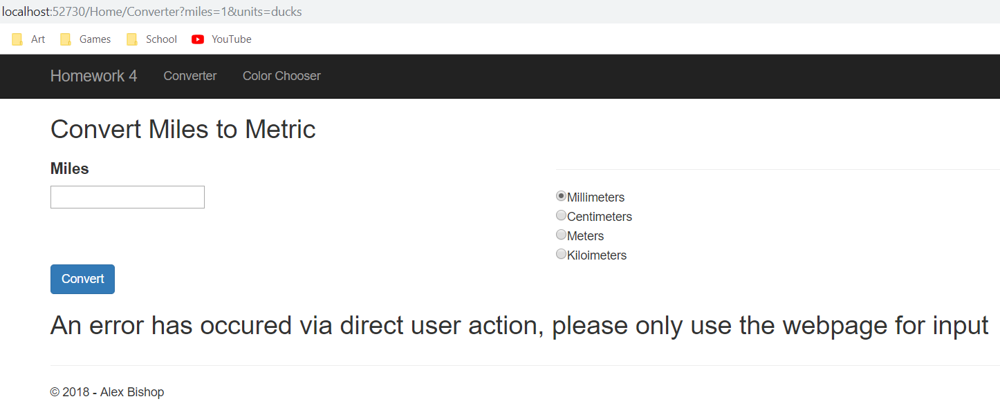

Note the unit "ducks" in the url. I get an error warning the user to not use the url for input. This is what we want, but what would happen if we tried to put a non-number in the miles field in the url. Well, we would trigger out of the error state as so:

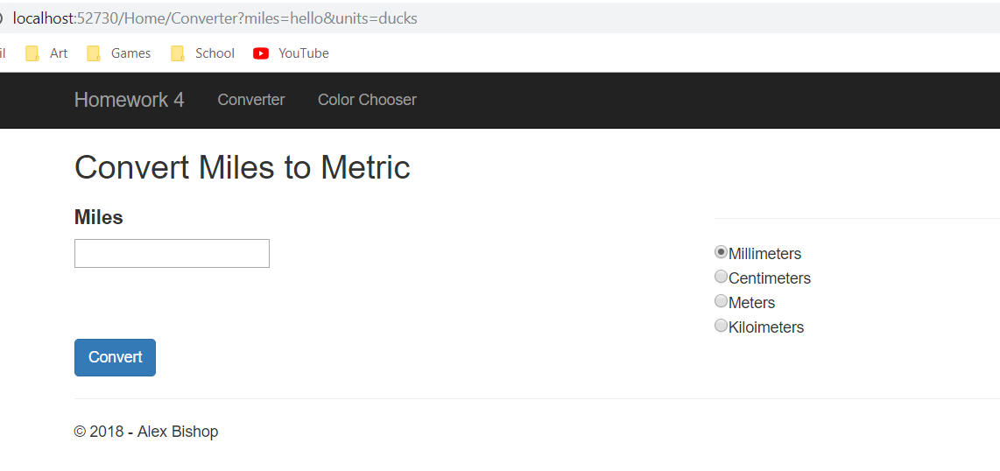

We see that the url has been editied, but thanks to our error stating, nothing breaks the webpage. Finally, trying to do another conversion will correctly change the contents.

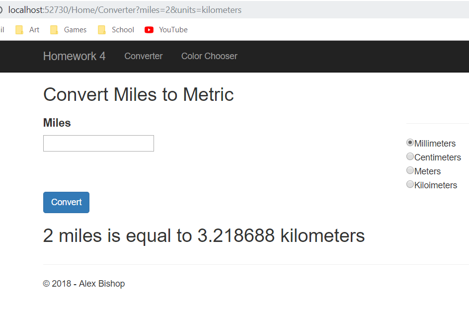