# CS460 Homework 5

# Return to?
### [Code Repo](https://github.com/Alex-Bishop1296/Alex-Bishop1296.github.io) 
### [Home](../index.md) 
### [CS460 Assignments](cls-cs460.md) 

# Notes

# 1 & 2.[Setup & Planning] 
I began this project like all the others I have done, by branching from master into a hw-five dev branch. This project consists of 3 pages, a basic homepage, a submission page, and the table view. For the most part, all of the planning was done for me via the requirements. Thus, most of this assignment will be going over the process.

# 3 - 7. [Coding/Content]
Here I will go over the process of making my database and model. To start, I created a new MVC project, cut it down to one page, and began the process to create a model. My code for my model looks like the follwing:
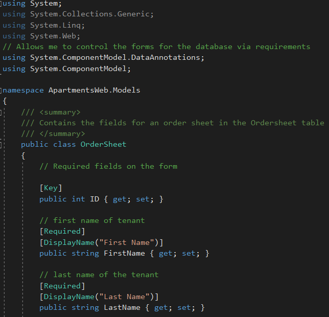
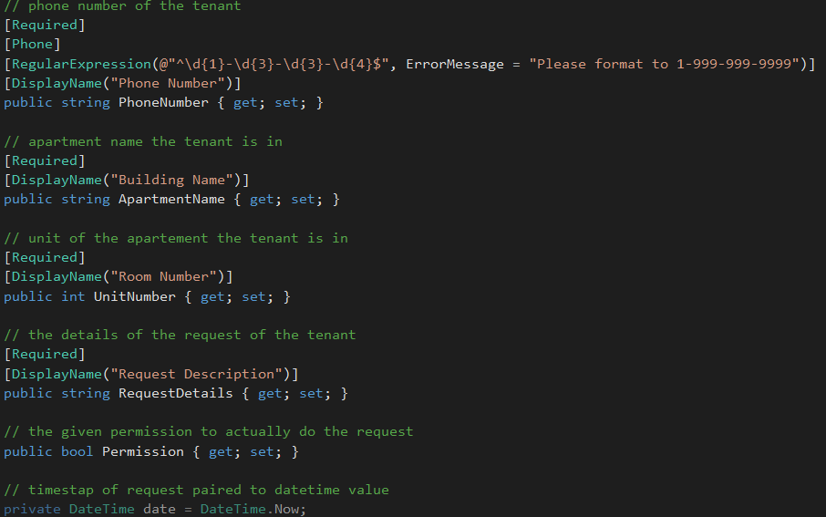
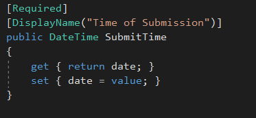
This code has a few things of note. The general purpose is to create the fields of a single entry of the table of workorders for my website. By creating it in the form of an object like this, we can help make it strongly typed view of the page. You may notice before we declare each variable we have a series of [] arguments. These annotations allow us to adjust how the fields are used in HTML and will throw error message if they don't meet requirements set in these. (Please note more annotations have been added since this screenshot via validations edits) For example you see the required annotation for any field that must be entered with a value before the submission for the form later. We alos set up the sumbit time to create itself automatically rather than being user entered. With the model done, we needed to take some steps to create the database with a table for the model. To start, I created a .mdf or database object via the ADD options built into Visual Studio inside the App Data folder. From here, I need a context of the model to give to the database, here is how my context file looks in my created DAL folder:
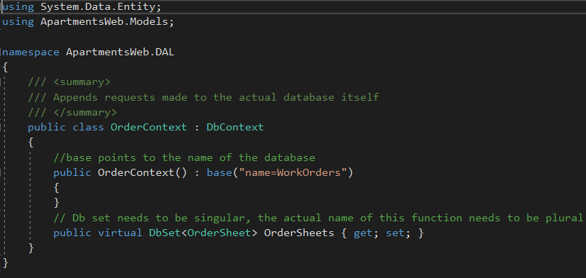
Not much to say about this code. Please note that the Base is the work orders DB, but the dbset is singular while the actual name of the function is plural, this is required to do proper scaffolding and for general convention. I had to fix this issue otherwise the thing would not correctly interact with the database. With these two items done I had to make edits to the we needed to make edits to the web config and the packages config to include the access string for the server and allow my project to properly interact with all the parts of the database. With these in place I could actually make my code to create the table in my database, which looks like the following:
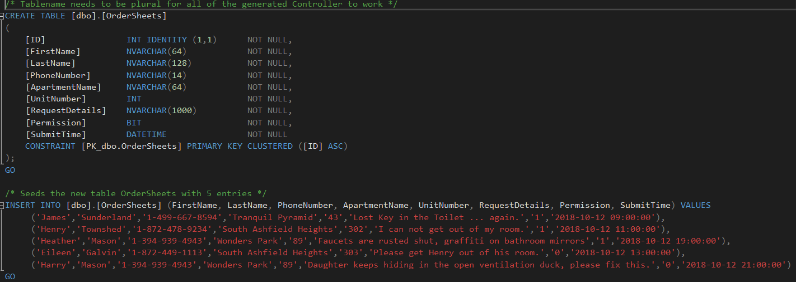
Pretty simple stuff, here, I create the table using the fields in our model while setting character limits on most items, then I seed the table with a few values. I name the table OrderSheets to keep a convention. My down code is nothing else but an if loop for if the table exists, if it exists then we drop the table. This code is really simple, so let's actually move onto the views of th website and how they function.

The homepage view has no major changes from the default but removing a lot of fluff, it looks like so:
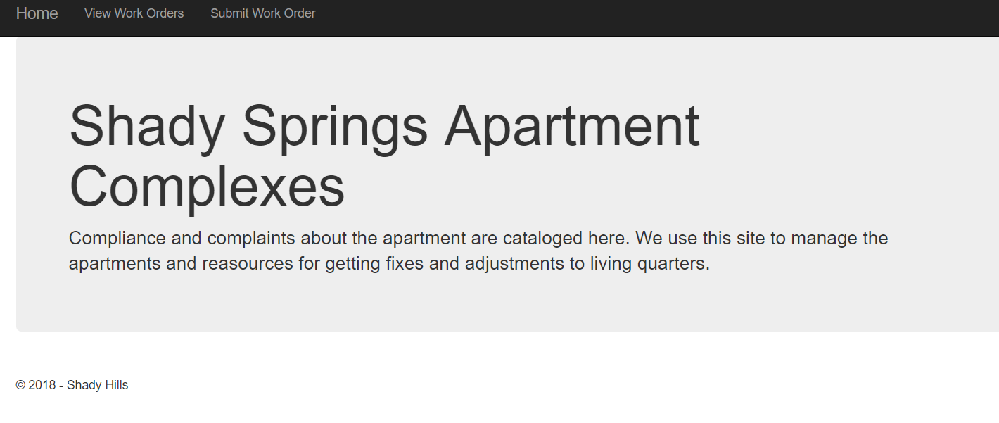
Notice that the links have being put in for the table view and submission form. The cshtml looks like so:
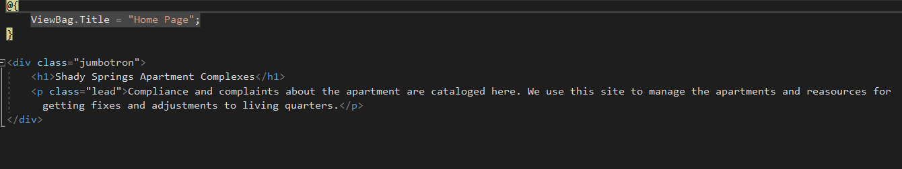
Basic stuff here, a viewbag and a head with a divider for the text. I store the navbar in the layout as well as the footer. I'll ignore it since it is minor changes again and not important for this assignment. Next we can move onto our first important view, the table.

The CSHTML for the table view looks like so:
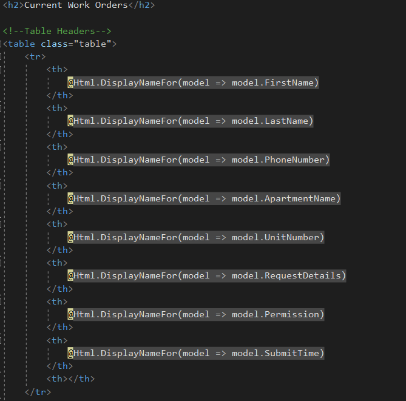
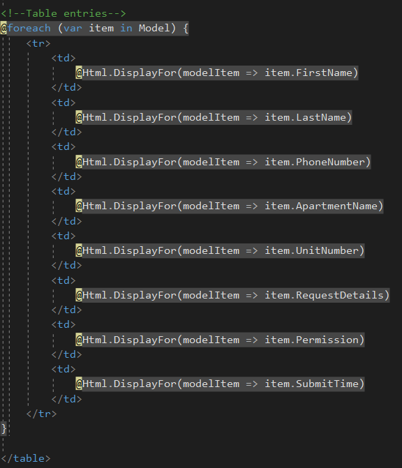
This was code that was generated with the controller for my table I made with scaffolding, then cut down to what I need with some edits. It is a series of threads for each field of the table that needs to bee displayed, then a for each loop for the whole table to display them all. This code works in tandem with the controller, which looks like so:
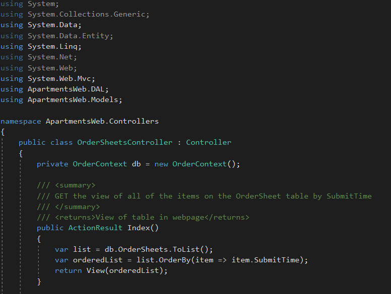
He we have the controller for the table stored in the index method function, noting that my project has seperated controllers for the homepage and the table views. Notice it is a GET method with us grabbing the database and putting it in a list, sorting that list via submission time, and returning that table to the view. This allows us to display the results by submission time as per requirement, the final view looks like this:
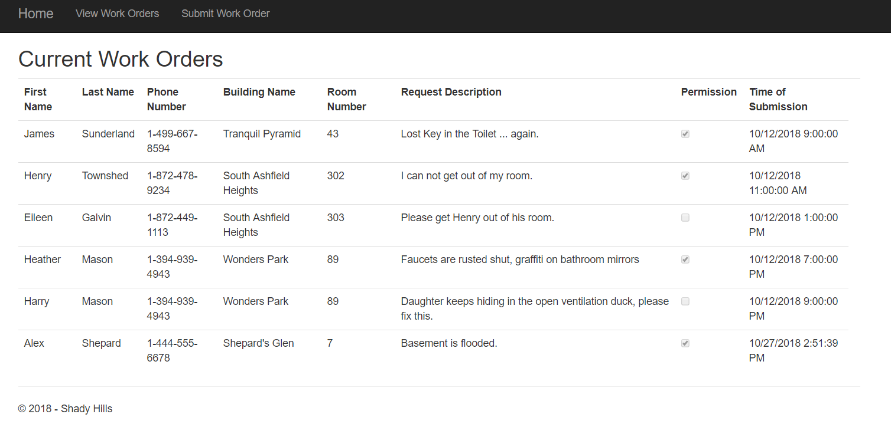
Somethings to note here. We see plainly that the table is sorted in order of submission time, as we needed. Also we can see the names we defined are showing up over the actual variable names. We also have an entry I added after we seeded the list, on that topic, we should look at the more complex create view.

The CSHTML for the create view looks like so:
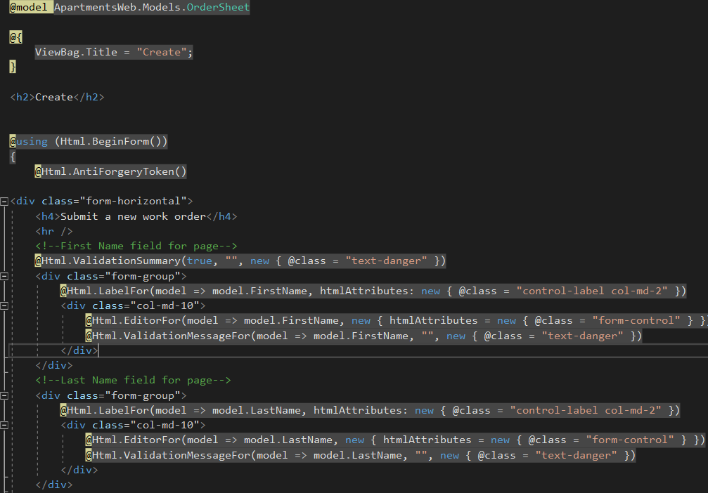
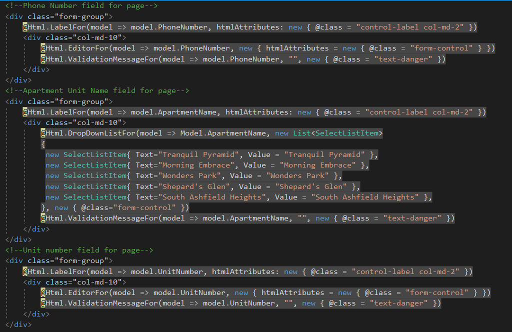
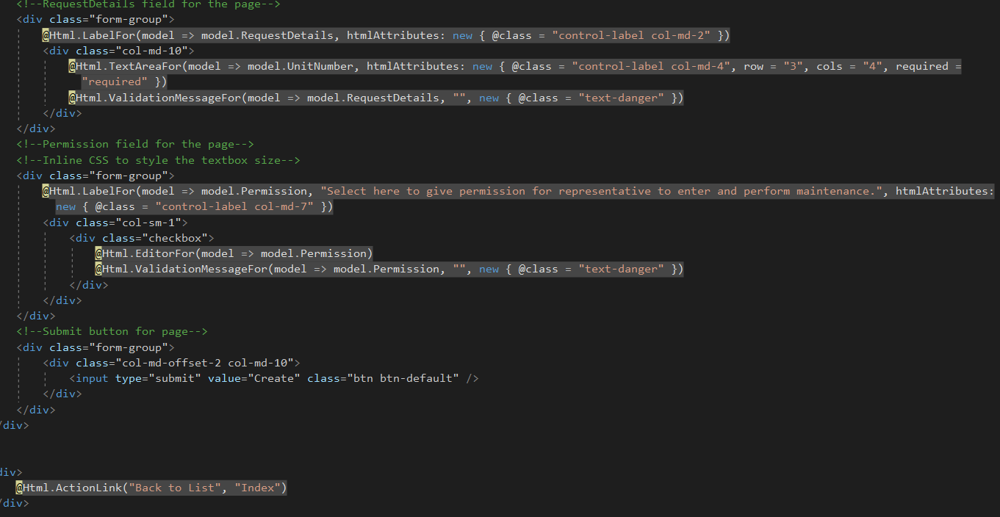
A bit to talk about here, we open by importing our model for the table, this will allow us to access elements from it. The first few input fields are the same ones the scaffolding put in, editor fields for being single string fields for firstname and lastname, and phone number; as well as number input fields for unit number. Note that these fields have their requirements carry over from the annotations in the model, more on that when we look at the view. The first departure from the scaffolding is the apartment unit. I decided to let it be one of multiple options rather than allowing the user to enter their own, after all the system should only have one of a few options as the company can only own so many units. Next, we have the request details, which has been changed to a text area to allow better vision of larger requests. These elements are combined with the controller CS, whuch we will look at now:

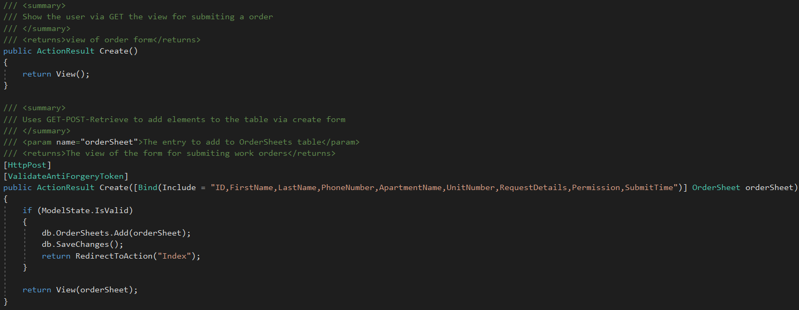
The first part of this controller is simply the GET method for displaying the input form. The next part however, is our GET-POST-Redirect loop. This allows us to add the item to the queue, post them to the staging area, and redirect them to the table. We do binding of the elements to a object of the model to make sure it fits in the table. With this all out of the way, let's look how the website functions:
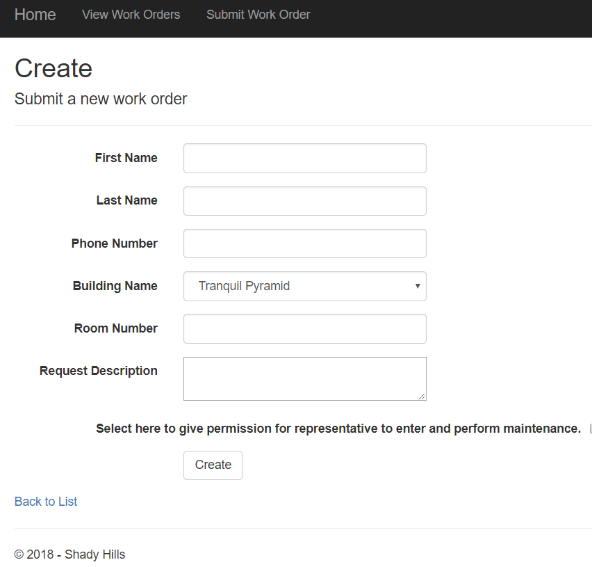
Here is what blank view looks like, note we have no field for the sumbit time as we generate that on our own, lets put in a test field and see what it does:
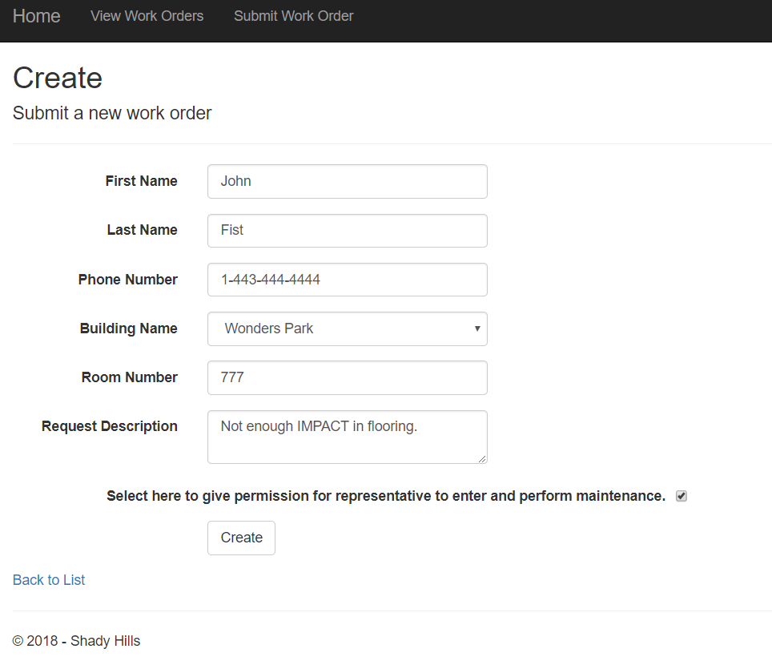
This is the data, before submission, upon hitting the submit button, it routes us back to the table view, and we see:
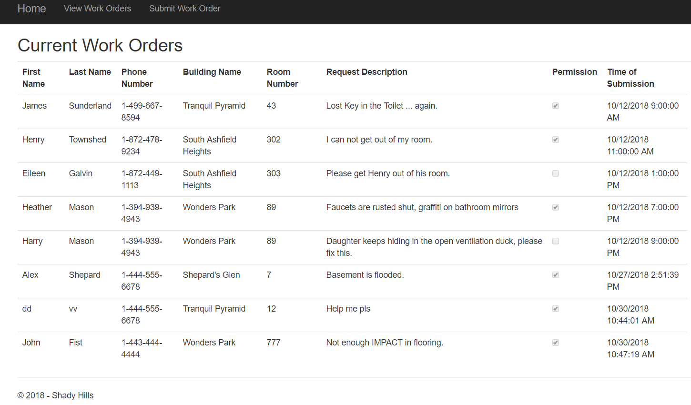
We can see at the bottom the new entry has been added. To show the actual error checking, let's try to submit and empty form:
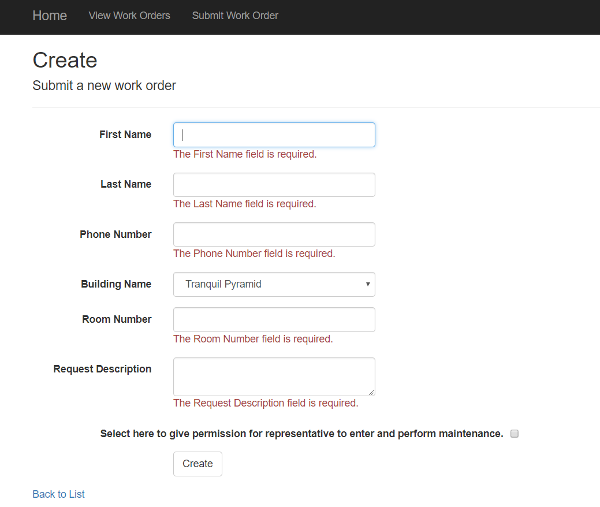
The system correctly throws errors for each field that is empty. With this all set and done, my project has been completed. I merged back to master and wrote the view portfolio entry youy see now.