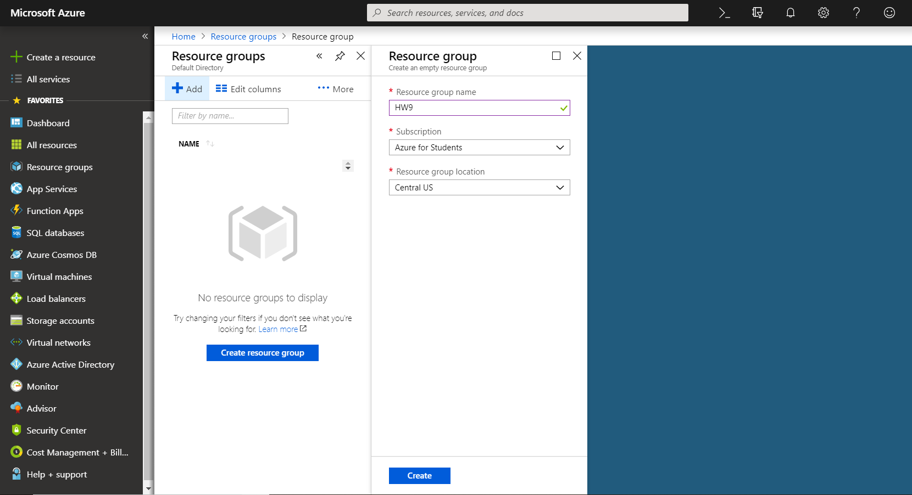
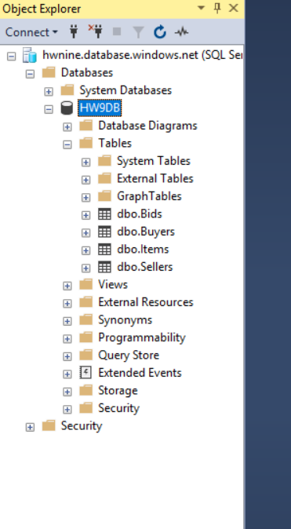

# CS460 Homework 9

# Return to?
### [Code Repo](https://github.com/Alex-Bishop1296/Alex-Bishop1296.github.io) 
### [Home](../index.md) 
### [CS460 Assignments](cls-cs460.md) 

### Major Steps Taken with Screenshots

### Made Resource Group

### Made SQL DB

### Adjusted Firewall

### Loading in SQL Server Manager

### Getting the connection string

### Creating the Web App

### Connecting the connection string to Azure

### Proof the publish to the web happened

### DEMO 1

### DEMO 2

###Link to our working website:
[Demo it here](http://cs460auctionhousea.azurewebsites.net/)